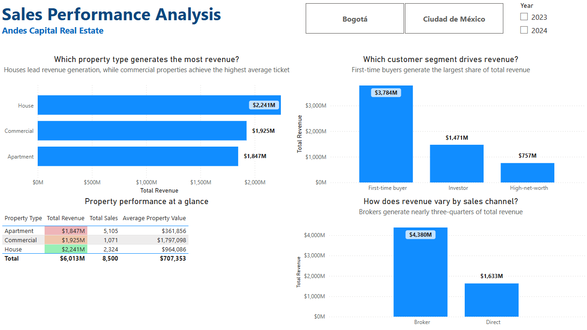

# Real Estate Sales Performance Dashboard

An interactive Power BI dashboard designed to analyze real estate sales performance across Bogotá and Mexico City. The project combines transaction, customer, and property data to evaluate sales value, property performance, customer segments, sales channels, and repeat purchase behavior.

> **Academic Project**
>
> This project was developed for educational purposes as part of a Data Analytics program, using a simulated real estate business case.

---

## 📌 Project Overview

This project analyzes 8,500 real estate transactions across 2023–2024, focusing on the factors that drive sales performance and customer purchasing behavior.

The analysis was developed in Power BI using a dimensional data model and an interactive dashboard to support performance monitoring and business-oriented decision-making.

---

## 🏢 Business Context

A real estate company needs to understand how its sales performance varies across markets, property types, customer segments, and sales channels.

This simulated business case uses historical transaction data from Bogotá and Mexico City to identify the main sources of sales value, understand customer repurchase behavior, and highlight areas that could support commercial decision-making.

---

## 🎯 Analysis Objective

### Main Objective

Evaluate real estate sales performance and identify the main drivers of sales value across markets, property types, customer segments, and sales channels.

### Analysis Questions

* How does sales value evolve over time?
* Which city and property types generate the highest sales value?
* Which customer segments contribute most to sales value?
* How does sales value vary by sales channel?
* What does customer repeat purchase behavior reveal about retention?

---

## 📊 Data Sources

### `hecho_ventas_propiedades.csv`

Fact table containing 8,500 real estate transactions from 2023–2024. It provides the core information for sales performance analysis, including transaction dates, sale prices, property types, cities, sales channels, and commissions.

### `dim_clientes.csv`

Customer dimension containing 3,500 customers and their buyer segments and locations. It supports customer segmentation and repeat purchase analysis.

### `dim_propiedades.csv`

Property dimension containing 8,000 properties, including property type, location, size, number of bedrooms, listed price, and property category.

The three datasets are combined through customer and property identifiers to support the Power BI analysis.

---

## 🔎 Analysis Process

* **Data modeling:** Structured transaction, customer, and property data into a dimensional model for analysis in Power BI.
* **Data integration:** Connected the sales fact table with customer and property dimensions using their respective identifiers.
* **Sales performance analysis:** Evaluated total sales value, sales volume, average property value, commissions, geographic performance, and temporal trends.
* **Segmentation analysis:** Compared performance across property types, customer segments, cities, and sales channels.
* **Customer behavior analysis:** Evaluated repeat purchase behavior and developed monthly customer cohorts based on first purchase date.

---

## 🔑 Key Findings

### Mexico City leads total sales value

Mexico City generated **$3.24B** in total sales value, compared with **$2.77B** in Bogotá, making it the stronger market in the analyzed period.


### Houses generate the highest total sales value

Houses generated **$2.24B** in total sales value, followed by commercial properties at **$1.93B** and apartments at **$1.85B**.

Commercial properties, however, had the highest average transaction value at approximately **$1.80M**, indicating a substantially higher ticket size despite a lower number of transactions.

### Brokers are the main sales channel

Broker-assisted transactions generated **$4.38B**, representing roughly three-quarters of total sales value. Direct sales generated **$1.63B**.

This indicates that broker activity plays a central role in the company's current sales performance.



### First-time buyers contribute the largest share of sales value

First-time buyers generated **$3.78B** in sales value, followed by investors at **$1.47B** and high-net-worth customers at **$757M**.

This suggests that acquisition of new buyers remains a major contributor to overall sales performance.

### Sales value increased in 2024

Total sales value increased by **11.14% in 2024 compared with 2023**. The monthly trend also shows recurring periods of higher sales activity, particularly around March–April and September–November.

Customer analysis additionally shows that approximately **77% of customers made more than one purchase**, indicating a high level of repeat purchasing within the analyzed customer base.

---

## 💡 Recommendations

* **Prioritize Mexico City as a key growth market** by evaluating which commercial and customer factors are contributing to its higher sales value.
* **Maintain a strong broker strategy** while monitoring broker performance and identifying opportunities to improve the contribution of direct sales.
* **Use property-specific strategies:** houses drive the highest total sales value, while commercial properties generate the highest average transaction value.
* **Strengthen customer retention initiatives** by identifying and engaging customers with previous purchase activity to encourage additional transactions.
* **Use seasonal patterns in sales planning** to align commercial campaigns and sales resources with historically stronger periods.

---

## ⚠️ Analysis Limitations

* The analysis covers only **2023–2024**, limiting the ability to assess longer-term market trends.
* The dataset does not include additional factors such as marketing spend, lead generation, property availability, or sales representative performance, which could provide further context for explaining sales outcomes.
* Customer segmentation is based on predefined buyer categories rather than a data-driven clustering methodology.
* The analysis identifies patterns and associations in the available data but does not establish causal relationships between the observed factors and sales performance.
* The cohort analysis provides additional insight into repeat purchasing behavior but is not included as a visualization in the portfolio presentation.

---

## 🗂️ Repository Structure

```text
real_estate_sales_performance_dashboard/
├── README.md
├── Real_Estate_Sales_Performance_Dashboard.pbix
├── data/
│   ├── dim_clientes.csv
│   ├── dim_propiedades.csv
│   └── hecho_ventas_propiedades.csv
└── images/
    ├── overview.png
    └── sales_performance.png
```

---

## 🛠️ Tools and Technologies

* Power BI Desktop skills utilized:
  * Power Query
  * Basic Data Modeling (Table Relationships)
  * Dashboard Layout and Design with core charts (Bar, Line, Column, Cohorts)
  * Calculated Columns and Tables
  * Measures

---

## 🔄 Reproduction Process

1. Clone or download the repository.
2. Open `Real_Estate_Sales_Performance_Dashboard.pbix` using Power BI Desktop.
3. If Power BI requests the source files, point the data connections to the CSV files located in the `data/` folder.
4. Refresh the data model.
5. Interact with the dashboard using the available city, property type, and year filters.

The repository includes both the Power BI file and the source datasets required to understand and reproduce the analysis.

---

## 👤 Author

**Edgar Rojas**

*Data Analytics Portfolio Project*
